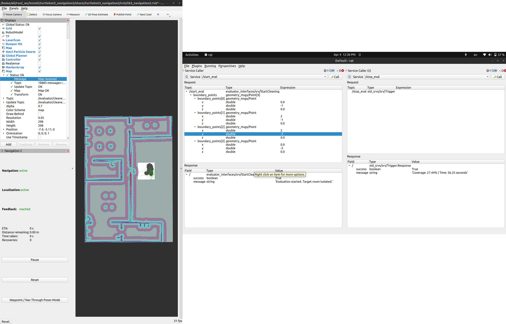

# TurtleBot3 Cleaning Evaluator System

This repository contains the **Referee Node** used to measure project performance for the robotic cleaning task. It calculates Area Coverage (%) and Simulation Time (seconds) within a designated room.

## 1. Installation

1. Clone this repository into your ROS 2 workspace's `src` folder:
   ```bash
   cd ~/ros2_ws/src
   git clone git@github.com:ake1999/evaluator_system.git
   ```
2. Build the workspace:
   ```bash
   cd ~/ros2_ws
   colcon build --symlink-install --packages-select evaluator_interfaces evaluator_core
   source install/setup.bash
   ```

## 2. Setup for Presentation (RViz)

To see your progress in real-time, you **must** add the evaluation map to RViz:
1. Launch your simulation and Navigation2 stack.
2. In **RViz**, click **Add** -> **By Topic**.
3. Select `/evaluator/cleaned_map` (Map display).
4. Change the **Color Scheme** to `costmap` or `rainbow` to see the green cleaning trail.



## 3. Running the Evaluator

Standard Run (Default Settings):
Use this if you are using the standard TurtleBot3 setup with no namespace.
```bash
ros2 run evaluator_core evaluator_node
```
*Defaults: map_topic='/map', base_frame='base_link', map_frame='map'*

Run the referee node. If you use custom topic names (e.g., a namespace), provide them as parameters:
```bash
ros2 run evaluator_core evaluator_node --ros-args -p map_topic:=/my_map -p base_frame:=base_footprint
```

## 4. How to Use in Your Project Code

During your presentation, your own nodes should call these services automatically:

### Start Evaluation
Call the `/start_eval` service (type: `evaluator_interfaces/srv/StartCleaning`). Provide 4 points (x, y) in meters for your room corners. Once called, the map will 'carve out' only that room.

### Stop Evaluation
When your cleaning logic is complete, your node must call the `/stop_eval` service (type: `std_srvs/srv/Trigger`).

## 5. Manual Testing (rqt)

For debugging, you can use the **Service Caller** plugin in `rqt` to trigger `/start_eval` and `/stop_eval` manually. The final results will be printed in the node terminal and returned in the service response.
